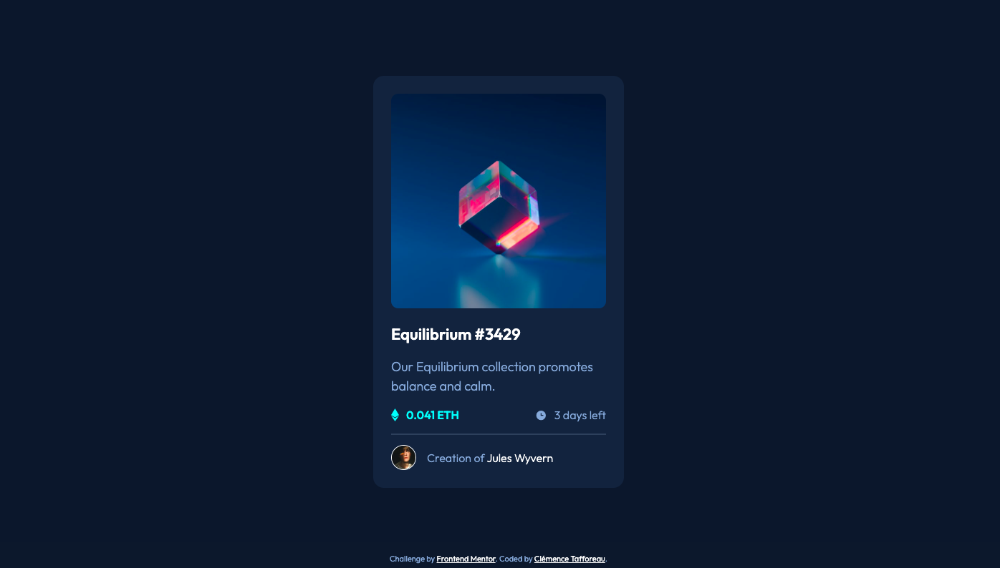

# Frontend-Mentor-NFT-preview-card-component
A solution I submitted for Frontend Mentor's NFT preview card component challenge

# Frontend Mentor - NFT preview card component solution

This is a solution to the [NFT preview card component challenge on Frontend Mentor](https://www.frontendmentor.io/challenges/nft-preview-card-component-SbdUL_w0U). Frontend Mentor challenges help you improve your coding skills by building realistic projects. 

## Table of contents

- [Overview](#overview)
  - [The challenge](#the-challenge)
  - [Screenshot](#screenshot)
  - [Links](#links)
- [My process](#my-process)
  - [Built with](#built-with)
  - [What I learned](#what-i-learned)
  - [Continued development](#continued-development)
  - [Useful resources](#useful-resources)
- [Author](#author)

## Overview

### The challenge

Users should be able to:

- View the optimal layout depending on their device's screen size
- See hover states for interactive elements

### Screenshot

### Links

- Solution URL: (https://github.com/ClemenceTafforeau/Frontend-Mentor-NFT-preview-card-component)
- Live Site URL: [Add live site URL here](https://your-live-site-url.com)

## My process

### Built with

- Semantic HTML5 markup
- CSS custom properties
- Flexbox

### What I learned

I learned how to use pseudo-classes. I also learned how to overlay elements.

### Continued development

I really struggled with combining overlaid elements and the active pseudo-class.

### Useful resources

- [Yoksel's URL Encoder](https://yoksel.github.io/url-encoder/) - This helped me with encoding one of the svgs provided with this project.
- [Kevin Powell's Youtube channel](https://www.youtube.com/@KevinPowell) - As always, very useful ressource for beginners like me, especially regarding the use of Flexbox.

## Author

- Frontend Mentor - [@ClemenceTafforeau](https://www.frontendmentor.io/profile/ClemenceTafforeau)
